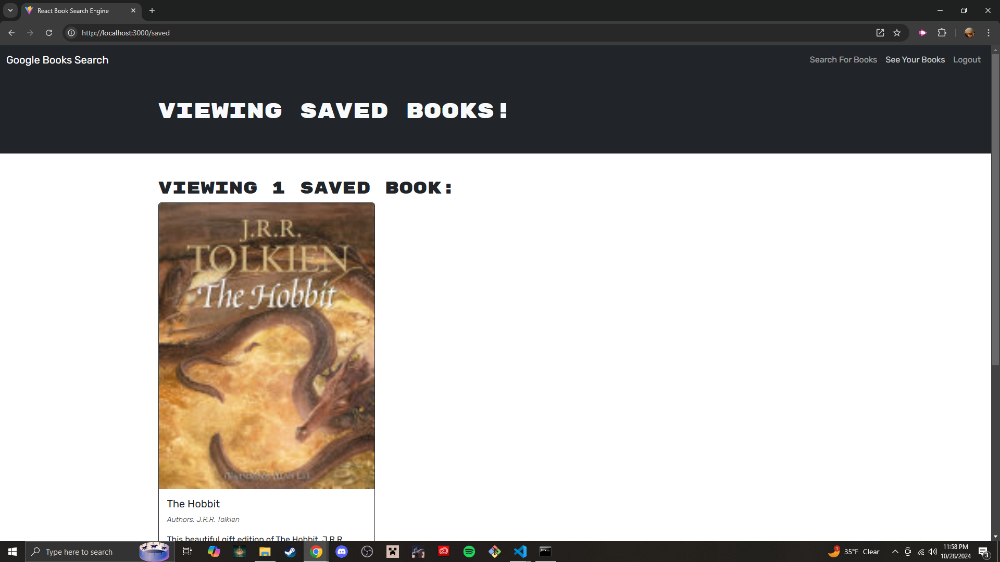

# MERN: Book Search Engine

## Description
Users can create accounts to save their favorite books, providing a personalized experience as they explore new titles. The application features authentication via JWT, allowing secure access to saved books and a seamless user experience.
## Screenshot

## Deployed
[https://pwa-text-editor-2-h3ky.onrender.com/](https://mern-book-search-1-w7it.onrender.com/)
